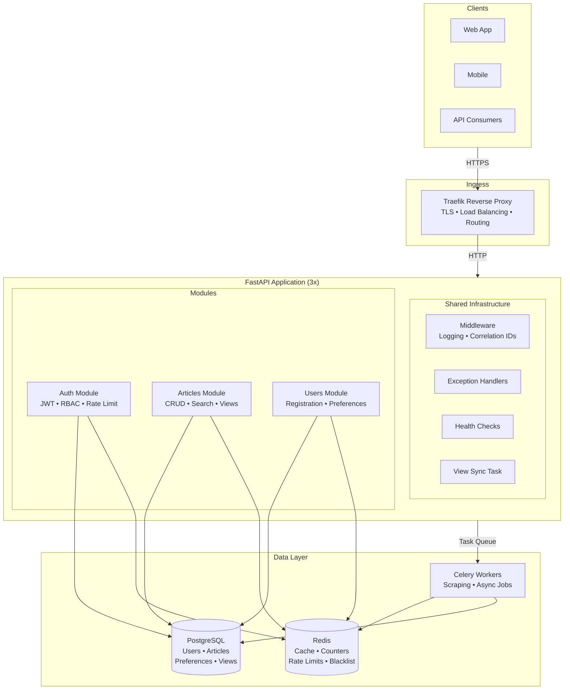

**News Recommendation System**

A scalable, containerized news recommendation API built with FastAPI, PostgreSQL, Redis, and Celery. This project ingests articles, tracks user views in real time, and serves personalized recommendations based on user preferences and article metadata.

---

## Features

- **User Authentication & Authorization**: JWT-based auth with role-based access control (admin/user).
- **Article Management**: CRUD endpoints for articles with indexing for efficient queries.
- **Personalization & Preferences**: Users can save articles and set preferences for categories and sources.
- **Real-Time View Tracking**: In-memory, Redis-buffered, and periodic flush to PostgreSQL for view counts.
- **Recommendation Engine**: Simple content-based recommendations via `RecommendationService`.
- **Background Tasks**: Celery workers for scraping, data processing, and asynchronous jobs.
- **Rate Limiting**: IP- and user-based rate limiting using FastAPI-Limiter and Redis.
- **Containerized Deployment**: Docker Compose for development and Docker Swarm stack for production.
- **Database Migrations**: Alembic for versioned schema migrations.

---

## Architecture



### Data Flow

1. **Request Ingress**: Client → Traefik (TLS) → FastAPI app replica
2. **Authentication**: JWT validated; user/role loaded (eager-load for perf)
3. **Caching**: Hot content served from Redis; cache-miss fetches from PostgreSQL
4. **View Tracking**: Increments buffered in memory → flushed to Redis → periodic sync to DB
5. **Background Jobs**: Celery workers poll Redis broker for scraping/processing tasks
6. **Response**: JSON response with correlation ID header for traceability

---

## Tech Stack

- **Language & Framework**: Python 3.13, FastAPI
- **Database**: PostgreSQL 17
- **Caching & Broker**: Redis 7
- **Task Queue**: Celery with Redis broker
- **Migrations**: Alembic
- **Containerization**: Docker, Docker Compose, Docker Swarm, Traefik
- **Testing**: Pytest, pytest-asyncio

---

## Getting Started

### Prerequisites

- Docker & Docker Compose
- (Optional) Python 3.13 and pip for local development

### Environment Variables

Copy `.env.example` to `.env` and update values:

```bash
cp .env.example .env
# then edit .env
```

### Development Setup

1. Build and start services:

```bash

docker-compose up --build

```

2. Apply database migrations:

```bash
docker-compose exec app alembic upgrade head
```

3. Seed initial data (admin user, roles, permissions):

```bash

docker-compose exec app python backend/scripts/seed_data.py

```

4. Access the API docs at `http://localhost:8000/api/docs`.

### Running Tests

```bash
docker-compose exec app pytest --cov
```

---

## Docker Swarm Deployment

For production-grade orchestration with load balancing and zero-downtime updates:

1. Initialize Swarm mode (if not already done):

```bash
docker swarm init
```

2. Build the production image:

```bash
docker build -t news-analyzer:local .
```

3. Deploy the stack:

```bash
docker stack deploy -c docker-stack.yml news-stack
```

4. Verify services are running:

```bash
docker service ls
```

The system will run with:

- **3 app replicas** (4 workers each = 12 total workers)
- **Traefik load balancer** on port 80
- **Zero-downtime rolling updates** (2 replicas at a time, 10s delay)
- **PostgreSQL 17** with persistent volumes
- **Redis 7** in global mode

Access the API at `http://127.0.0.1/health` or `http://127.0.0.1/api/v1/articles/`

---

## Usage

Endpoints are grouped under `/api/v1`:

- **Authentication**: `/api/v1/auth/login`, `/api/v1/auth/register`
- **Users**: `/api/v1/users/` CRUD and role management
- **Preferences**: `/api/v1/preferences/` save and fetch user preferences
- **Articles**: `/api/v1/articles/` list, retrieve, and recommend
- **Admin**: `/api/v1/admin/` user-role and permission management

Refer to the interactive Swagger UI at `/api/docs` for complete request/response schemas.
